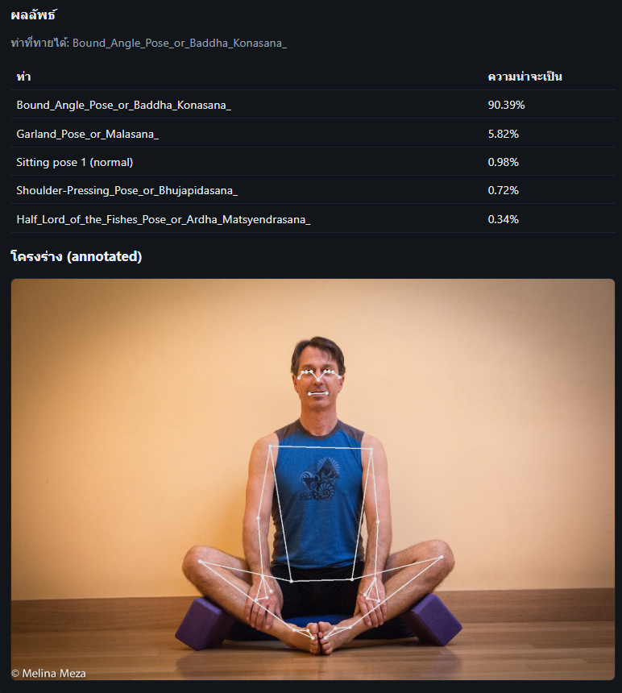

# Yoga-82 BlazePose XGBoost

แอปตัวอย่างสำหรับจำแนกท่าโยคะจาก **Yoga-82** โดยใช้ **BlazePose** ดึงคีย์พอยต์ + **joint angles** แล้วเทรน **XGBoost**  
รองรับ **Realtime Demo (Webcam)** และ **เว็บแอปอัปโหลดภาพ** พร้อมบันทึก **Confusion Matrix** และ **Classification Report**

## โครงสร้างโปรเจกต์
```plaintext
yoga-blazepose-xgb/
├─ data/
│ ├─ train/ val/ test/ # โฟลเดอร์ย่อยเป็นชื่อท่าโยคะ
│ ├─ yoga82_train.csv # จะถูกสร้างโดยสคริปต์สกัดคีย์พอยต์
│ ├─ yoga82_val.csv
│ └─ yoga82_test.csv
│
├─ models/ # ผลลัพธ์หลังเทรน
│ ├─ yoga_cls.joblib # โมเดล XGBoost
│ ├─ scaler.joblib # StandardScaler
│ ├─ label_encoder.joblib # LabelEncoder
│ ├─ classes.txt # ลำดับคลาสที่ใช้สอน
│ └─ metrics/
│ ├─ classification_report.csv
│ ├─ confusion_matrix_norm.png
│ ├─ confusion_matrix_top30.png
│ ├─ confusion_matrix_raw.npy
│ └─ confusion_matrix_norm.npy
│
├─ src/
│ ├─ features.py # แปลง BlazePose landmarks -> ฟีเจอร์ (normalize + 12 joint angles)
│ ├─ extract_keypoints_splits.py # สกัดคีย์พอยต์จาก train/val/test -> CSV
│ └─ train_classifier.py # เทรน XGB + เซฟโมเดล + เซฟ Confusion Matrix/Report
│
├─ app.py # Flask แอปรายภาพแล้วทำนายท่า
├─ templates/index.html # หน้าเว็บอัปโหลด
├─ static/styles.css # สไตล์หน้าเว็บ
└─ requirements.txt
```
## การติดตั้ง

แนะนำ Python 3.10–3.11

```bash
python -m venv .venv
# Windows
. .venv/Scripts/activate
# macOS/Linux
# source .venv/bin/activate

pip install -U pip
pip install -r requirements.txt
```

## เตรียมข้อมูล
วางรูปลงในโฟลเดอร์:
```bash
data/train/<ClassName>/*.jpg|png
data/val/<ClassName>/*.jpg|png
data/test/<ClassName>/*.jpg|png
```

## ขั้นตอนการรัน
1) สกัดคีย์พอยต์ (BlazePose) -> CSV
```bash
python src/extract_keypoints_splits.py --data_root data --out_dir data
# ผลลัพธ์: data/yoga82_train.csv, data/yoga82_val.csv, data/yoga82_test.csv
```
2) เทรน XGBoost + เซฟ Confusion Matrix / Report
```bash
python src/train_classifier.py ^
  --csv_train data/yoga82_train.csv ^
  --csv_val   data/yoga82_val.csv ^
  --csv_test  data/yoga82_test.csv ^
  --out_dir   models

```
ถ้าใช้ GPU (CUDA) และ XGBoost 2.x ที่รองรับ:
```bash
python src/train_classifier.py ... --use_gpu
```
ผลลัพธ์สำคัญ:

- models/yoga_cls.joblib, models/scaler.joblib, models/label_encoder.joblib

- models/classes.txt

โฟลเดอร์ models/metrics/:

- classification_report.csv

- confusion_matrix_norm.png (รวมทุกคลาส, ไม่แสดงป้ายเพื่อกันล้น)

- confusion_matrix_top30.png (เฉพาะ 30 คลาสที่พบมากสุด อ่านง่ายกว่า)

- confusion_matrix_raw.npy, confusion_matrix_norm.npy

3) รันเว็บแอป (อัปโหลดภาพ -> ทำนาย)
```bash
python app.py
# เปิดเบราว์เซอร์ http://localhost:8000
```

ใบอนุญาต / เครดิต

BlazePose: Google MediaPipe

Yoga-82 dataset: ผู้จัดทำตามลิงก์ต้นทางของชุดข้อมูล (ตรวจสิทธิ์การใช้งานตามแหล่งที่มา)
```bash
https://www.kaggle.com/datasets/akashrayhan/yoga-82/data
```
## Confusion Matrix
  


## App.py Run Test


